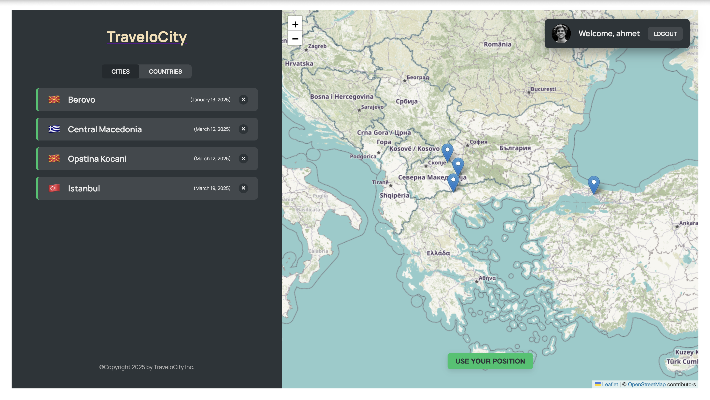

# TraveloCity



traveloCity, ziyaret ettiğiniz şehirleri kaydetmenize ve bu şehirlerle ilgili notlar tutmanıza olanak sağlayan bir web uygulamasıdır. Seyahat deneyimlerinizi takip etmek, anılarınızı kaydetmek ve gelecekteki seyahatlerinizi planlamak için mükemmel bir araçtır.

## Özellikler

- 🗺️ Harita üzerinde ziyaret ettiğiniz şehirleri görüntüleme
- 📝 Her şehir için notlar ve anılar ekleme
- 📅 Ziyaret tarihlerini kaydetme
- 🔍 Şehirlerinizi filtreleme ve arama
- 📱 Mobil ve masaüstü cihazlarda duyarlı tasarım

## Kurulum

Bu projeyi yerel makinenizde çalıştırmak için aşağıdaki adımları izleyin:

1. Repoyu klonlayın:
```bash
git clone https://github.com/ahmetyusufer/traveloCity.git
cd traveloCity
```

2. Bağımlılıkları yükleyin:
```bash
npm install
```

3. Geliştirme sunucusunu başlatın:
```bash
npm run dev
```

4. API sunucusunu başlatın (ayrı bir terminal penceresinde):
```bash
npm run server
```

Uygulama şimdi `http://localhost:5173` adresinde çalışıyor olmalı ve API sunucusu `http://localhost:8000` adresinde çalışıyor olmalıdır.

## Teknolojiler

Bu proje aşağıdaki teknolojileri kullanmaktadır:

- [React](https://react.dev/) - Kullanıcı arayüzü için JavaScript kütüphanesi
- [React Router](https://reactrouter.com/) - Sayfa yönlendirme
- [Leaflet](https://leafletjs.com/) - Etkileşimli haritalar için açık kaynaklı kütüphane
- [React Leaflet](https://react-leaflet.js.org/) - React için Leaflet bileşenleri
- [React DatePicker](https://reactdatepicker.com/) - Tarih seçici bileşeni
- [Vite](https://vitejs.dev/) - Hızlı geliştirme ortamı
- [JSON Server](https://github.com/typicode/json-server) - Tam sahte REST API

## Proje Yapısı

```
traveloCity/
├── public/            # Statik dosyalar
├── data/              # JSON verileri
│   └── cities.json    # Şehir verileri
├── src/               # Kaynak kodları
│   ├── components/    # React bileşenleri
│   ├── contexts/      # Context API dosyaları
│   ├── hooks/         # Özel React hooks
│   ├── pages/         # Sayfa bileşenleri
│   ├── App.jsx        # Ana uygulama bileşeni
│   └── main.jsx       # Giriş noktası
└── README.md          # Proje dokümantasyonu
```

## Kullanım

1. Uygulamayı açın ve haritayı görüntüleyin
2. Ziyaret ettiğiniz bir şehri eklemek için haritada bir konuma tıklayın
3. Şehir bilgilerini ve notlarınızı girin
4. Kaydettiğiniz şehirleri solda bulunan panelden görüntüleyin
5. İstediğiniz zaman şehirlerinizi düzenleyin veya silin
